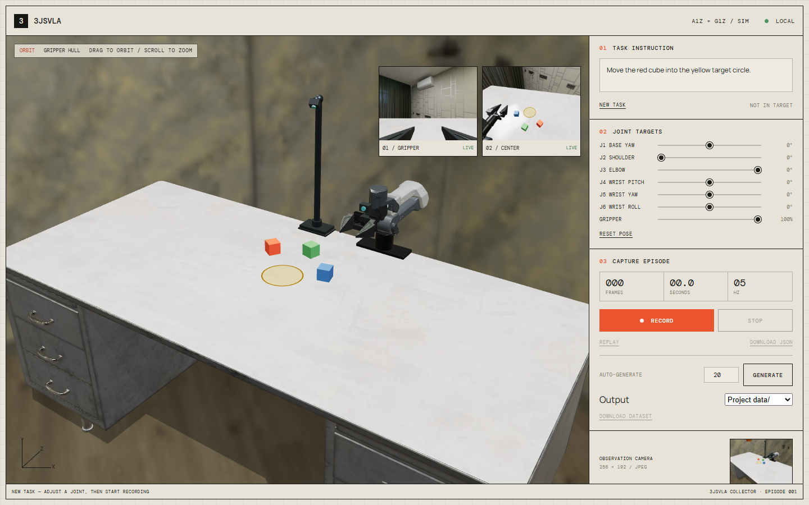
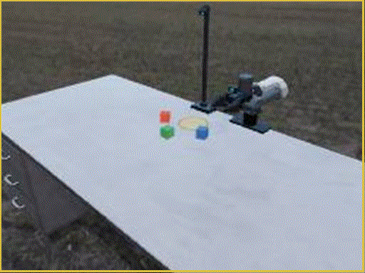

# 3jsVLA



3jsVLA is a compact, browser-based robot manipulation environment for learning the complete Vision-Language-Action data loop. It renders an A1Z arm with a G1Z parallel gripper in Three.js, simulates contacts and rigid-body dynamics with Rapier, and records camera observations, robot state, language instructions, and actions as training episodes.

The current task is simple and varied: **move the requested coloured cube into the yellow target area**. Cube positions, target position, requested colour, cube rotations, and HDR environment are randomised for every episode.

## Task Demo

The scripted controller approaches the requested cube, establishes a physical bilateral grasp, moves it to the target, releases it, and returns the arm to its neutral pose.



## Features

- Three.js scene with the official A1Z/G1Z URDF and mesh assets
- Rapier rigid-body physics for the arm, gripper, cubes, and desk
- Constrained numerical IK with collision-aware vertical approaches
- Friction-based grasping using the physical finger geometry
- Gripper-mounted and central overview RGB cameras
- Manual control, recording, replay, and automatic demonstration generation
- Per-episode scene and HDR randomisation
- Direct output to the project `data/` directory through the local Vite server
- Conversion to LeRobotDataset v3 with `tools/to_lerobot.py`

## Quick Start

Requirements: Node.js 20 or newer and a modern desktop browser.

```bash
npm install
npm run dev
```

Open the URL printed by Vite, normally [http://127.0.0.1:5173](http://127.0.0.1:5173).

The default robot is A1Z + G1Z. The legacy SO-101 scene remains available at:

```text
http://127.0.0.1:5173/?robot=so101
```

## Generate Demonstrations

1. Enter the number of episodes in **Auto-generate**.
2. Keep **Output** set to **Project data/**.
3. Press **Generate** and keep the page in the foreground.
4. Completed episodes are written to a timestamped directory under `data/`.

Every episode starts and ends at the neutral command pose:

```text
J1-J6: 0 degrees
Gripper: 100% open
```

An episode is successful when the requested cube is released, resting on the table, and fully inside the yellow circle. A 60-second wall-clock timeout stops a run that becomes stuck. Failed or interrupted episodes are not written as completed demonstrations.

## Dataset Layout

```text
data/<run-id>/
|-- meta.json
`-- episodes/
    `-- episode_00000/
        |-- episode.json
        `-- frames/
            |-- 000000.jpg
            `-- ...
```

Each frame contains:

```text
timestamp
observation.image_path
observation.joint_positions
observation.object_poses
observation.grasped
action.joint_targets
```

`joint_positions` records the measured physical state. `joint_targets` records the command a policy should produce. Object poses and grasp state are ground truth for debugging and evaluation; they are not required as policy inputs.

## Convert to LeRobot

Create a Python environment and install the converter requirements:

```powershell
python -m venv .venv
.venv\Scripts\python -m pip install -r tools\requirements.txt
.venv\Scripts\python tools\to_lerobot.py data\<run-id> --repo-id you/3jsvla-a1z --root lerobot_out
```

On Linux or macOS, replace `.venv\Scripts\python` with `.venv/bin/python`.

## Architecture

```text
Instruction + RGB cameras + joint state
                    |
                    v
               VLA policy
                    | action
                    v
Three.js renderer - Robot controller - Rapier physics
        ^                                  |
        `----------- observation ----------'
```

- **Three.js** renders the scene, URDF meshes, cameras, lighting, and interface.
- **Rapier** computes arm, gripper, object, contact, and desk physics.
- **Constrained IK/QP** plans reachable task-space waypoints.
- **The recorder** samples RGB, state, and next-step actions at 5 Hz.
- **Python tooling** converts browser output into a training-ready LeRobot dataset.

## Project Structure

```text
3jsVLA/
|-- src/
|   |-- main.ts             # scene, physics, task, controller, recorder
|   |-- constrained-ik.ts   # numerical IK and constraints
|   |-- contact-state.ts    # physical contact and grasp checks
|   `-- style.css           # collector interface
|-- public/assets/
|   |-- robots/             # URDF and robot meshes
|   |-- models/             # desk model
|   `-- hdri/               # randomised environments
|-- tools/
|   |-- to_lerobot.py
|   `-- requirements.txt
|-- docs/
|-- data/                   # generated runs
|-- index.html
`-- package.json
```

## Current Scope

3jsVLA is an educational simulator and data-generation project, not a validated digital twin. The scripted controller is useful for producing demonstrations, but difficult layouts can still fail because of IK reach, tracking error, collision, or unstable frictional grasping.

Planned next steps are training a small behaviour-cloning policy, running inference in the browser loop, and adding repeatable evaluation metrics.

## License

A project license has not been selected yet.

